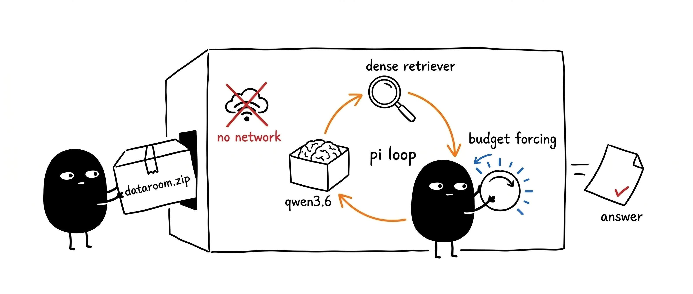
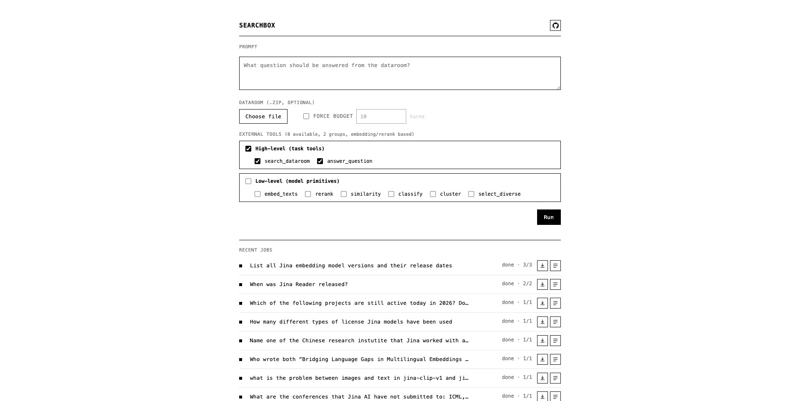
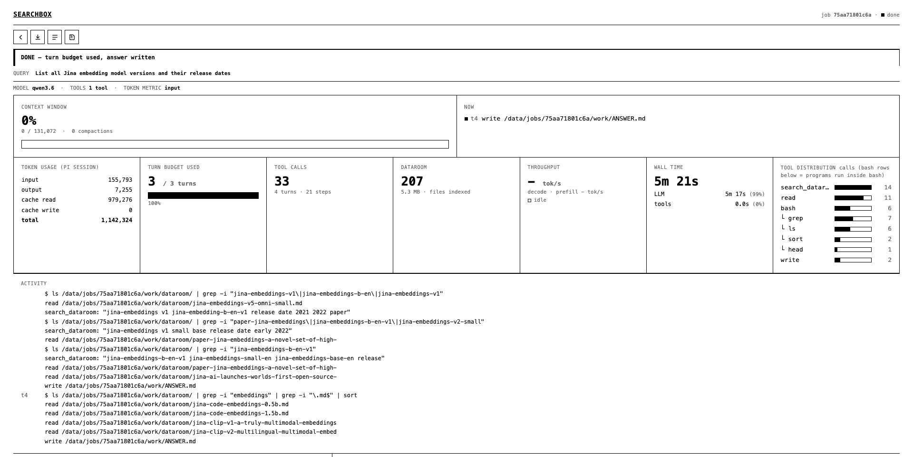

# Searchbox

Given a query, [a `.zip` dataroom](https://github.com/hanxiao/dataroom), and a token budget. The local `Qwen3.6-35B-A3B` in a
minimal [Pi](https://pi.dev) harness explores the dataroom with local tools such as bash, grep, embeddings, rerankers in an **airgapped** loop, then answers.



<p align="center">
  <b>Live demo → <a href="https://hanxiao.io/searchbox">hanxiao.io/searchbox</a></b>
</p>


## Why

Everyone who knows me knows I'm super test-time-compute-pilled. In my view, **search is test-time compute (TTC)**: you wire trained embeddings, rerankers, single-/multi-vector retrievers, and query expanders into a pipeline to squeeze out relevancy. Don't scale TTC, say a keyword search hands you the answer, and it's probably not good enough. Scale it, say add embedding search then filter with a reranker, and you most likely get a better one. So I built `searchbox` as a testbed to explore a few questions on TTC:

- Model preferences: which tool does it reach for in agentic search?
- [Is grep really all you need](https://arxiv.org/abs/2605.15184), i.e. where does a dense retriever add nothing to search quality?
- Does scaling test-time compute via token budget forcing give better answers, especially on the hard questions?

To make this work, I prebuilt a few projects to pave the road for searchbox: [dataroom](https://github.com/hanxiao/dataroom), which does agentic crawling and spits out a zip; and [knowledge-graph](https://github.com/hanxiao/knowledge-graph-extractor), which extracts entity relations and walks the longest path to find non-trivial questions to test searchbox with. Feel free to dig into those too.

Finally, I made searchbox an airgapped harness, because I don't want the model cheating with web information. I want to lock search in the box and itt should exhaustively and exclusively use what's in the box (which is a knowledge dump .zip from the web via [dataroom](https://github.com/hanxiao/dataroom), but not at the searchbox step).

## How it works

You submit a prompt, [an optional dataroom `.zip`](https://github.com/hanxiao/dataroom) (when not given the built-in `jina-corpus.zip` is then used), and a turn budget from the homepage:



`server/run_searchbox.py` then drives a `pi --mode rpc` session:

1. The dataroom is unzipped to `dataroom/` (read-only; a single wrapper dir is stripped). The
   sidecar (`server/dataroom_service.py`) indexes **nothing** at boot - retrieval scopes are
   embedded lazily on first use, and embeddings are cached per `(text, role)` for the life of the
   job process so identical text is never embedded twice (across turns or tools).
2. The task is appended to Pi's **system prompt** (`--append-system-prompt`): answer from
   `dataroom/`, no network, use any tools or build your own, write the answer to `ANSWER.md`. It
   is present every turn and never compacted, so the task stays stable for the whole budget. The
   question is sent once as the first user message. No skill.
3. Pi runs its own loop and compaction, untouched. The only thing added over vanilla Pi: while
   the budget is unspent and Pi goes idle, send a bare `Continue.`. As a backstop the harness
   also captures the model's final non-thinking message to `ANSWER.md` each turn, so there is an
   answer even if the model never wrote the file itself (it never clobbers a model-written one).
4. Force-budget OFF (default): stop after the **first turn** (turn=1 probe - the common case for
   measuring single-shot answer quality). ON: run until the turn budget is used (one turn = one
   `Continue.` -> agent works -> idle). `run_meta.json` records stop reason, turns, per-turn token
   breakdown, tool calls, and config. (We stop at a turn boundary because a run cannot be cleanly
   interrupted mid-turn anyway, and turns are the user-legible unit.)

The per-job dashboard streams the live run: context window, token usage, turn budget, tool-call
distribution (with the actual programs each `bash` ran), wall-time split, and an ACTIVITY feed
showing every tool call **with its parameters**.



## Models

Three model roles, each independently swappable (env knobs) and runnable on **local weights or the
Jina cloud API** (`EMBED_BACKEND` / `RERANK_BACKEND` = `local` | `api`):

| Role | Default | Other built-in options | Knob |
| --- | --- | --- | --- |
| Agent LLM | [`Qwen3.6-35B-A3B`](https://huggingface.co/Qwen/Qwen3.6-35B-A3B), served as the [`unsloth/Qwen3.6-35B-A3B-GGUF`](https://huggingface.co/unsloth/Qwen3.6-35B-A3B-GGUF) `UD-Q4_K_XL` quant | any chat model you point `LLAMA_URL` + `MODEL_ID` at | `LLAMA_URL`, `MODEL_ID`, `CONTEXT_WINDOW` |
| Embedder | [`jina-embeddings-v5-text-small`](https://huggingface.co/jinaai/jina-embeddings-v5-text-small) | [`jina-embeddings-v5-text-nano`](https://huggingface.co/jinaai/jina-embeddings-v5-text-nano) (lighter) | `EMBED_MODEL`, `API_EMBED_MODEL` |
| Reranker | [`jina-reranker-v3`](https://huggingface.co/jinaai/jina-reranker-v3) | [`jina-reranker-v2-base-multilingual`](https://huggingface.co/jinaai/jina-reranker-v2-base-multilingual) | `RERANK_MODEL`, `API_RERANK_MODEL` |

- **Agent LLM** is the thing under test - it reads the dataroom and writes the answer. Our
  reference deployment runs `Qwen3.6-35B-A3B` (a Mixture-of-Experts model, 35B total parameters /
  ~3B active per token) as the unsloth `UD-Q4_K_XL` GGUF quant on `llama.cpp`, with **MTP
  speculative decoding** (`--spec-type draft-mtp`) for faster generation, 128K context, FlashAttn,
  and q8_0 KV cache. It is served over any OpenAI-compatible endpoint via `LLAMA_URL` /
  `MODEL_ID`, so you can swap in any chat model.
- **Embedder + reranker** power retrieval. Local loading supports both reranker families: v3
  (`AutoModel`) and v2-base-multilingual (`AutoModelForSequenceClassification`); the loader picks
  whichever class exposes `.rerank()`.
- **Local GPU with auto-CPU-offload**: `EMBED_DEVICE=cuda` runs retrieval on the GPU, but if the
  card lacks headroom (a colocated agent LLM already filled VRAM) the loader checks free VRAM
  against `MIN_FREE_VRAM_MB` (default 1500) and transparently falls back to CPU instead of OOMing;
  CUDA OOM at load time is caught too. `EMBED_DEVICE=cpu` (default) keeps all VRAM for the LLM.
  This is why a single 24 GB box running the agent LLM serves retrieval through the API backend
  (the weights would not fit alongside the LLM), while idle/larger boxes run everything locally.

The retrieval models are the *same two* whether you pick `local` or `api` - only where embed/rerank
runs changes (a clean local-vs-api ablation axis). Embeddings are L2-normalized on both paths
(cosine == dot).

## Tools

The external tools come from one source of truth, `pi/tools-catalog.json`, registered by
`pi/extensions/dataroom-search.ts` and validated by `server/app.py`. Every tool is a thin wrapper
over the sidecar's two models (jina-embeddings-v5-text-small + jina-reranker-v3). They are split
into **two tiers** (the `group` field drives the UI grouping + per-group master toggle):

**High-level (task tools)** - dataroom-aware, one call does the whole job. The tool reaches into
the uploaded dataroom for you (this is where the implicit corpus state lives, by design - it is
explicit in the tool's contract):

| Tool | What it does |
| --- | --- |
| `search_dataroom` | Embed corpus + query, return top-k relevant chunks `{path,chunk,score,text}`. One-stop semantic search over the dataroom. |
| `answer_question` | Two-stage: dense-retrieve a wide candidate set, then cross-encoder **rerank** to the few best supporting passages. |

**Low-level (model primitives)** - stateless single-model ops that act **only on data you pass
in** (no hidden corpus/state); the model composes its own pipeline (grep/read to get text, then
these):

| Tool | What it does |
| --- | --- |
| `embed_texts` | Embed caller text -> append vectors to a jsonl file (returns `{path,count,dim}`, not the vectors). |
| `rerank` | Cross-encoder score caller-supplied documents against a query. |
| `similarity` | Cosine similarity over caller text (pairwise if equal-length, else full matrix). |
| `classify` | Zero-shot label each text by nearest-label embedding similarity. |
| `cluster` | Greedy-threshold cluster caller text into near-duplicate groups. |
| `select_diverse` | Facility-location pick of the top-k most diverse texts (drop near-dups). |

The split makes intent obvious - a model that just wants an answer uses the high-level tools; one
that wants control composes the primitives - and keeps the only stateful behavior (reaching into
the corpus) confined to the explicitly dataroom-aware high-level tools. Built-in Pi tools
(`read`, `bash`, `grep`, `find`, `ls`, `edit`, `write`) keep their stock descriptions.

All embedding flows funnel through one cached `_encode(text, role)`, so repeated text (same chunk
across turns, same query reused, overlap between tools) is embedded at most once per job.

`SEARCHBOX_TOOLS` gates which tools a run registers (the tool-ablation axis):

- **unset** -> the catalog `default: true` set: `search_dataroom`, `answer_question`
- **`""`** (empty) -> none; Pi built-ins only (grep/read baseline)
- **`a,b,...`** -> exactly those (e.g. `embed_texts,rerank` to force the low-level path)

## Components

```
server/dataroom_service.py        sidecar: /search /answer /embed /rerank /similarity /classify
                                  /deduplicate /cluster /stats over the unzipped dataroom
                                  (per-(text,role) embed cache)
server/run_searchbox.py           orchestrator: unzip -> drive Pi -> stop on budget
server/app.py + web/              upload UI + live dashboard + job queue
server/stats.py                   per-turn token/timing/tool parse from the Pi session + log
pi/tools-catalog.json             external-tool catalog (single source of truth, high/low tiers)
pi/extensions/dataroom-search.ts  registers the catalog tools, gated by SEARCHBOX_TOOLS
docs/img/                         UI screenshots used in this README
scripts/run.sh                    one-shot CLI run
scripts/ablate.py                 ablation sweep
tests/test_scheduler.py           scheduler tests (no GPU)
```

## Get started

### Prebuilt image (GHCR)

The full app image (torch + node + Pi + cached retrieval weights + searchbox source) is published
to GitHub Container Registry, so you can skip the build:

```bash
docker pull ghcr.io/hanxiao/searchbox:latest
docker run -d --name searchbox --gpus all -p 8001:8001 --env-file .env \
  -v $PWD/data:/data ghcr.io/hanxiao/searchbox:latest
# open http://localhost:8001
```

Tags: `latest` and a dated tag (e.g. `20260623`). Rebuild locally with `docker build -t
searchbox .` only when you change the source.

### From source

```bash
cp .env.example .env          # point LLAMA_URL at your OpenAI-compatible model server
uv venv --python 3.11 .venv
uv pip install --python .venv/bin/python torch -r server/requirements.txt huggingface-hub
npm install -g @earendil-works/pi-coding-agent@0.80.1   # pinned; see PI_VERSION

# one-shot CLI: prompt, dataroom, budget(turns), outdir
bash scripts/run.sh "Where is auth handled?" ./dataroom.zip 30 ./out
cat ./out/ANSWER.md
```

Web UI: `python -m server.app`, then open `http://localhost:8000`.

Web UI runs retrieval on local weights by default; set `EMBED_BACKEND=api RERANK_BACKEND=api` (+
`JINA_API_KEY`) to call the Jina cloud instead. See [Models](#models) for the built-in embedder /
reranker options and the GPU auto-CPU-offload behavior.

## Scheduling (single slot)

One model slot, so jobs run serially:

- **Foreground FIFO** - fresh submits and explicit resumes run oldest-first.
- **Preemption** - a new foreground job preempts whatever is running (incl. another foreground
  job) and takes the slot now (`PREEMPT_FOREGROUND=1`). The preempted job returns to the pool and
  resumes ahead of bulk backfill.
- **Auto-backfill** - when nothing is queued, the oldest paused job is auto-resumed (`--continue`)
  to keep the slot busy (`AUTO_BACKFILL=1`); such a run is preemptible.
- **Pause is sticky** - `POST /jobs/{id}/pause` -> `held`; not auto-resumed, only an explicit
  `POST /jobs/{id}/resume` revives it. (Preemption uses a separate, preemptible `paused` state.)

State survives an app restart: mid-flight jobs return to the resumable pool, held jobs stay held.
Logic is covered by `tests/test_scheduler.py` (no GPU; run `python tests/test_scheduler.py`).

## Ablation

Everything is an env knob - no code edits:

| Knob | Ablates |
| --- | --- |
| `SEARCHBOX_TOOLS` | which tools the model gets (see [Tools](#tools)) |
| `EMBED_BACKEND` / `RERANK_BACKEND` | retrieval on local weights vs Jina API |
| `LLAMA_URL` + `MODEL_ID` + `CONTEXT_WINDOW` | the base LLM |
| `EMBED_MODEL` / `RERANK_MODEL` | the retrieval models |
| `TURN_BUDGET` | the budget, in turns |

```bash
python -m scripts.ablate --query "..." --dataroom ./dataroom.zip --budget 10 \
  --matrix config/ablations.example.json --out ./runs/exp1
cat ./runs/exp1/results.jsonl    # one row per config
```

Default matrix (omit `--matrix`): `high_level` (search_dataroom + answer_question), `low_level`
(embed_texts + rerank + similarity), `no_tools` (grep/read baseline).

## Token accounting

The budget is a turn count, but per-turn token cost is still recorded (`turns.jsonl`,
`run_meta.json`, the dashboard). The reported field is **`input`** (fresh prefill tokens); the UI
also shows `output`, `cacheRead`, `cacheWrite`, `total`. Change the reported field with
`BUDGET_METRIC`.

Source of truth is the append-only Pi session file, summed over assistant-message `usage`. Pi's
`get_session_stats` sums only in-memory messages, which compaction prunes, so it undercounts a
long run; the session file is never rewritten, so it is compaction-safe. Timing (wall / LLM /
tool) is stopwatched from Pi's event stream; tok/s comes from llama.cpp `/metrics`.

## License

MIT
